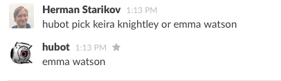

# hubot-decides

> A hubot script which randomly or not makes choice decisions.

## Installation

In hubot project repo, run:

`npm install hubot-decides --save`

Then add **hubot-decides** to your `external-scripts.json`:

```json
["hubot-decides"]
```

## Sample Interaction



See [test/decide-test.coffee](test/decide-test.coffee) for other usage examples.
